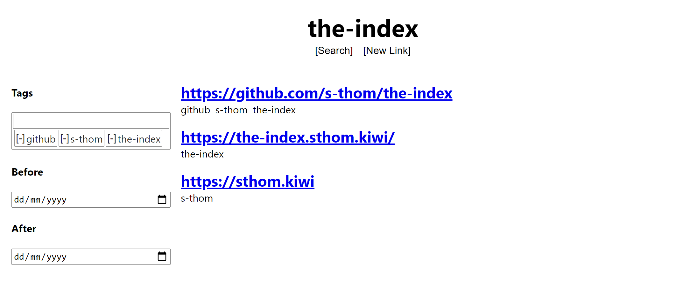

# [the-index](https://the-index.sthom.kiwi/)

A personal index.

I needed a place to store links to things in an organised manner, so I built one. It's still a work in progress.



## Development

Contributions are welcome. If you have any ideas, create an issue and let's talk!

More details on how to set things up for development are available in each of the packages' READMEs.

- [Read `packages/frontend/README.md`](https://github.com/s-thom/the-index/tree/master/packages/frontend)
- [Read `packages/backend/README.md`](https://github.com/s-thom/the-index/tree/master/packages/backend)
- [Read `packages/openapi/README.md`](https://github.com/s-thom/the-index/tree/master/packages/openapi)

## Running your own instance

If containers are your thing, then there are instructions for building using Docker below.

All these steps require Node.js (`14.x` or higher, `12.x` will probably work, but hasn't been tested). This project uses [lerna](https://github.com/lerna/lerna) to manage the multiple parts.

```sh
git clone git@github.com:lerna/lerna.git
npm install
npx lerna bootstrap
```

### Frontend

Running `npm run build` in the `packages/frontend/` directory will build the project into the `build/` directory.

```sh
cd packages/frontend
npm run build

npx serve build
```

If the frontend is being hosted on a different post/hostname from the backend, then you will need to set the `REACT_APP_SERVER_PATH` environment variable during the build. This can be done by setting it in the shell, or by adding it to a `.env` file within the `packages/frontend/` directory.

### Backend

Running `npm run build` in the `packages/backend/` directory will build the project into the `build/` directory.

```sh
cd packages/backend
npm run build

node build/index.js
```

Both a [database config file](https://typeorm.io/#/connection-options) (`ormconfig.json`) and some environment variables are required for the app to run. There are example files in the `packages/backend/` directory.

#### Adding users

There is currently no way to add users, apart from manually inserting them into the database.

```sql
INSERT INTO users (name)
VALUES ('<name-of-new-user>');
```

When the user tries to log in for the first time, they will be given a new TOTP secret to set up in an authenticator app.

### OpenAPI docs

If you feel like hosting the API documentation for whatever reason, then I guess you can do that too.

Running `npm run build` in the `packages/openapi/` directory will create a `build/the-index.yaml` file, that you can use with whatever OpenAPI viewer you like.

```sh
cd packages/openapi
npm run build

# Open build/the-index.yaml in the Swagger Editor (https://editor.swagger.io/)
```

## Docker

You can build container images for the frontend and backend using Docker.

```sh
docker build . -f ./docker/frontend.Dockerfile -t sthom/the-index-frontend:latest
docker build . -f ./docker/backend.Dockerfile -t sthom/the-index-backend:latest
```

### Frontend image

The frontend image is based on `nginx`, and serves the app from port `80` of the container. It's recommended that you have a reverse proxy in front of it (with HTTPS) before receiving traffic.

### Backend image

The backend image is based on `node`, and runs the app. It requires the same database configuration and environment variables as the non-containerised version (which means that if you're using an `ormconfig.json`, it must be mounted).
